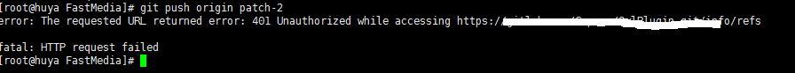

# Plugin script 上傳 git repository 問題


有人反應：用 git push 上傳時，會遇到 ```error: The requested URL retured error: 401 Unauthorized while accessing ... ``` 的錯誤。

這個錯誤有時候並不是真的因為 git repository 的問題。而是因為 git 的版本太舊。要看自己的 git 版本，下指令： ``` git --version ```。如果是 ```1.7``` 的話，就會有這個問題。

目前已知 ```git 1.9``` 以上就不會有這個問題。