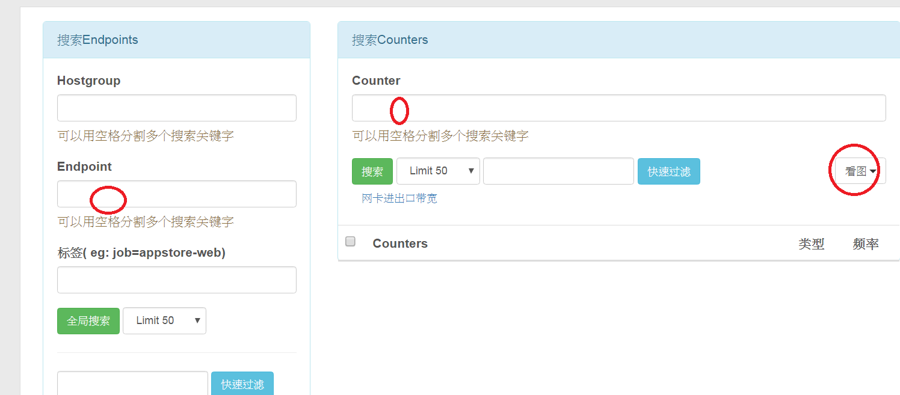
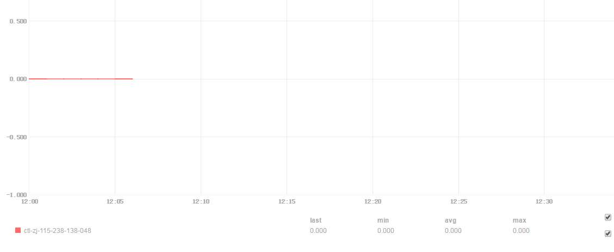
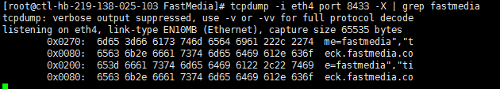

# 驗証與除錯

當 plugin script 上傳並且布署成功之後，需要做一系列的驗証工作。

* 在機器上手動執行 script ，利用 `python 輔助，肉眼檢查。`

  下指令： `60_traffic.sh | python -mjson.tool   
  可以將 plugin script 的輸出變成容易閱讀的格式。`

* 用繪圖、看圖的方式來驗証  
    
    
  如果發現，沒有畫出圖，例如說，線段沒有出現，或是值並不正常。就要進行更進一步的驗証。

* 如果懷疑上報異常，透過 `tcpdump 來做驗証。`

  需要下的指令是 `tcpdump -i 網卡名 -X port 8433`

  * 如果可以在 `tcpdump 的輸出看到數值有上報，那就是 plugin 有執行成功，且有上報到 open-falcon 的 transfer 模組。`
  * 如果無法在 `tcpdump 的輸出看到數值有上報，那就是 plugin 沒有執行成功，應該要看 agent 的 log 來做驗証、除錯。`
  * 可以透過按 `Ctrl + C 來結束 tcpdump `
    


* 透過 agent 的 log 來做驗証、除錯

  1. 首先要先設法找出 agent 所在的目錄：下指令 `ps aux | grep falcon-agent 以取得 process id`
  2. 然後下指令 `cat /proc/$pid/environ 如此就可以看出 falcon-agent 所在的目錄，$DIR_OF_AGENT。 `
  3. `tail -f $DIR_OF_AGENT/var/app.log`
  4. 可以透過按 `Ctrl + C 來結束 tail -f`

  典型的錯誤有可能長成這樣子：

  ```
  time="2016-12-06T13:08:28+08:00" level=error msg="json.Unmarshal stdout of plugin/FastMedia/60_fastmedia_worker_process.sh fail. error:invalid character ',' looking for beginning 
  of value stdout: \n[{  \"endpoint\"   : \"ctl-hb-219-138-025-103\",  \"tags\"       : \"\", \"timestamp\"  : 1481000908,  \"metric\"     : \"fastmedia.worker.process\",  \"value\"      : , \"counterType\": \"GAUGE\",  \"step\"       : 60}]\n\n"
  ```


## 常見的異常排除

1. 已經成功布署插件的機器 (host)，有的有出現插件的監控項，有的卻沒有。如圖

   這種情況最有可能的原因，應該是因為部分機器 (host) 的主機群 (hostgroup) 沒有正確的設置。因為插件 (plugin script) 的啟用，是將插件所在資料夾，綁定到 hostgroup 而啟用的。

   解決方式：檢查沒有出圖的機器所屬的 hostgroup 是否正確。

1. 某成對 (paired) 監控項，一個有圖、另一個卻沒有。如圖： 

   所謂成對 (paired) 的監控項，是指某些監控項的資料來源一樣、採集方式相同的監控項。如果成對的監控項一個有資料、另一個都是 0 ，這種情況比較高的機率是監控項的採集出問題。一般而言，無論是「內建監控項」或是「自訂監控項」，通常都是去讀取 linux 的系統指令輸出或是系統檔`/proc/*` 的內容。
   
   以 `net.if.in.bits` 和 `net.if.out.bits` 為例子，它們的資料來源是 `/proc/net/dev` 。所以可以利用下列的指令，監看資料來源的每秒的變動來除錯。
   
     `watch cat /proc/net/dev`